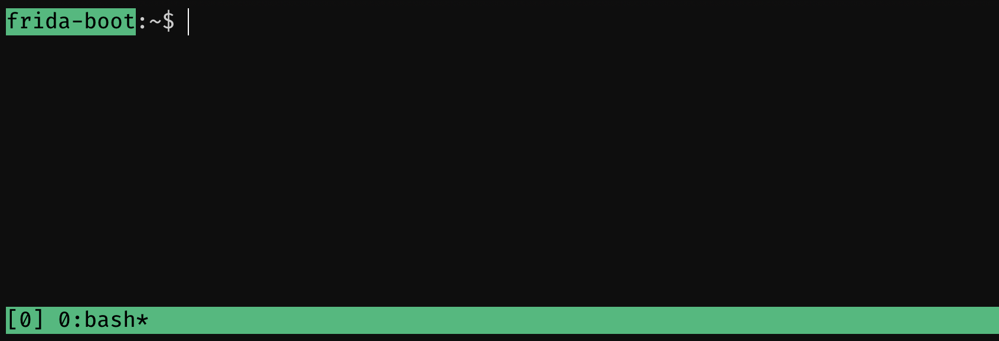

# Shells

Most of the commands used in this workshop are going to be run _inside_ your docker container. So, getting a shell inside the container is pretty important ^_^

There are a few options and you are free to choose how you want to go about that. Regardless of which route you choose, the initial launch of the container will always be the same. For more information, please see [starting](0-getting-started/starting).

## tmux

Once you have started the container, you should see a prompt with the words `frida-boot` in it. The container comes with `tmux` installed. If you are familiar with using `tmux` simply run it. The `tmux` configuration uses the default configuration, with the `ctrl+b` binding.



## docker exec

If you are not comfortable with `tmux`, that’s ok. You can simply execute more shells in the running container. Given that we specified the `--name` flag as `frida-boot` when we started the container, you can get another `bash` shell in the container with:

```bash
docker exec -it frida-boot /bin/bash
```


!> If the container is not running (or you got the name wrong), you can expect an error similar to: `Error: No such container: frida-boot`. The `docker ps` command should shed some light on which containers are running and what their names are!
