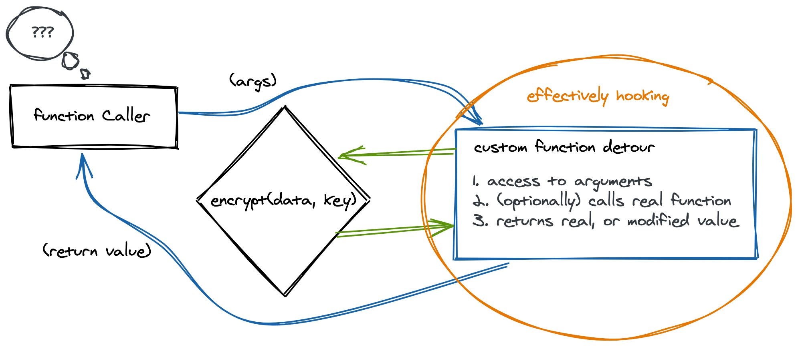

# Hooking 101

Hooking function calls in a program provides us with an incredibly powerful ability to see what’s happening "under the hood" of a running program. With hooking, we can "spy" on parts of a programs logic, or modify logic so that the program behaves completely differently. We can even reuse parts of the program against itself :) Let's look at an example.

Imagine some C functions for a moment that is responsible crypto related work. Ignoring the actual crypto implementation, they may look something like this:

```c
// Encrypt a buffer using key
void encrypt(int *data, char *key) {
    // encryption routine
}

// Get an encryption key
char * getKey() {
    // returns a key
}
```

When a program makes a call to `encrypt()`, `key` will be passed to it as an argument. Using hooking the idea would be to reveal what the value of `key` is as the function is called. Practically depending on how the hooking is performed, one may simply echo the `key` value to screen and allow the function to continue normally.

Considering the `getKey()` function for a moment, hooking to reveal arguments may be less interesting, whereas the `return` value is. When hooking we can possibly reveal the key when the function returns, or, we can provide our own key value instead.

## Typical hooking flow

Conceptually, when you are hooking a function, the method of hooking intercept the call to a function and redirect to a piece of code that you control. When done, it would typically return. Calling the original function is many times optional.

To help visualise this, consider the following diagrams. Without any funny business (read: hooking) going on, a normal function call would occur something like this:


Now, if we were to introduce a hook, we would update the code flow to something like this:



Don't worry if that wasn't perfectly clear yet. You are going to do this soon yourself.
