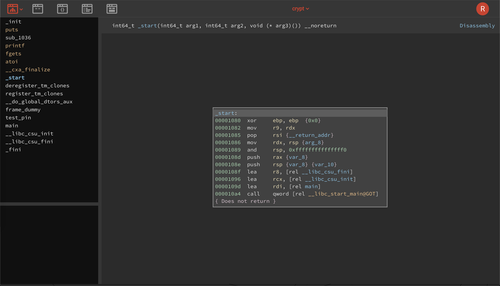
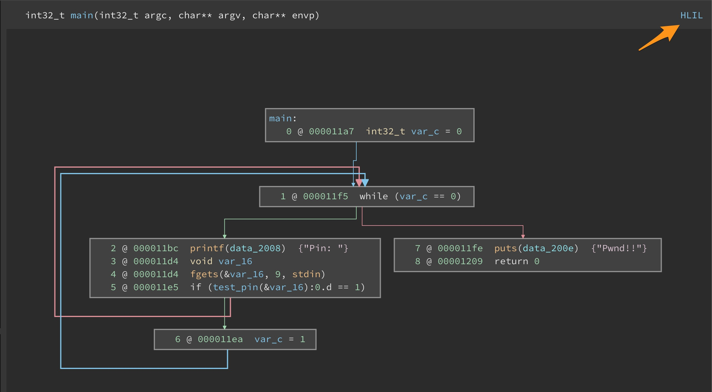
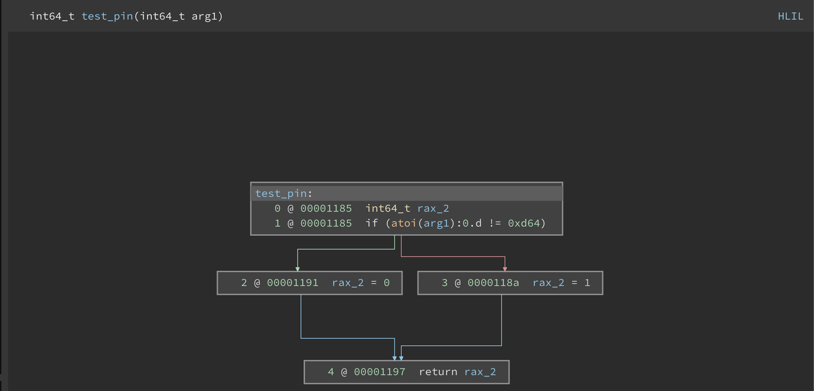

# repurposing code

We have scratched the surface with a number of Frida features thus far, reusing our `pew.c` program to explore them. In this section we are going to shift focus to a new program called `crypt`. The source code for `crypt` is also available in the `software/` folder, but I want to encourage you to not peek at it :)

In the docker container, make a copy of the `crypt.c` file from the `software/` folder and move it to your `code/` folder. Next, compile it with `gcc crypt.c -o crypt`. Once you have compiled it, try and run it.

```text
~/code$ cp ../software/crypt.c .
~/code$ gcc crypt.c -o crypt
~/code$ ./crypt
Pin: 1234
Pin:
```

Playing with the program you will see that it continiously asks for a pin. We need t guess the right pin!

## understanding crypt

Now we can totally just open the `crypt.c` source code and have a look at how it works. We are not going to do that and instead (and just like how it would often be the case for closed source software) we will need to reverse the program first.

There are _plenty_ of options available to you to decompile software. I want to take this opportunity to introduce you to [BinaryNinja](https://binary.ninja/), more specifically their [cloud](https://cloud.binary.ninja/) decompiler that is free to use, and perfect for little crackmes / CTF's.

To use it, register an account over at [https://cloud.binary.ninja/](https://cloud.binary.ninja/) and sign in. Next, start a new session and upload the `crypt` binary. Once the analysis is compelted, you should see the entrypoint of the binary.



On the left you should see the functions in the binary. Double click on `main`, and then click on the word _Disasembly_ on the right until it says _HLIL_



_HLIL_ is their new High Level Interpreter Language, and as you can see it looks pretty great!

You should see the Control Flow Graph for the `main()` function of `crypt`, where a `while(var_c == 0)` loop exists. In the true case (green leg), we can see the a `printf("Pin: ")` followed by an `fgets()` call.

Next, a call to `test_pin` is made, taking `var_16` as an argument. If `test_pin` returned `1`, `var_c` becomes 1, meaning the next run of the `while` block, we will have `printf("Pwnd!!")`!

Ok neat, so we are definitely interested in the `test_pin` function it seels. Double click it either in the block, or on the name on the left. This should take you to the CFG for `test_pin`.



## spying on test_pin

While static reverse engineering is interesting, let's take all of the tricks we have learnt using Frida, and spy on the `test_pin` function. We want to use the `Interceptor.attach()` API, and dump the argument and return value of `test_pin()`.

Run `crypt` in one shell, prepare a JavaScript file called `pin.js` and then inject Frida using `frida crypt -l ping.js` in another shell.

Now, write the Frida script that will let you spy on the `test_pin` function, dumping its arguments.

<details>
<summary>The script (Click to expand)</summary>

```javascript
var testPin = DebugSymbol.getFunctionByName("test_pin");

Interceptor.attach(testPin, {
    onEnter: function(args) {
        console.log("test_pin(" + args[0] + ")");
    },
    onLeave: function(retval) {
        console.log(" => ret: " + retval);
    }
});
```

</details>

In the Frida console, that script should output the following:

```text
test_pin(0x7ffcf8673602)
 => ret: 0x0
test_pin(0x7ffcf8673602)
 => ret: 0x0
test_pin(0x7ffcf8673602)
 => ret: 0x0
 ```

From that we can deduce that `test_pin` gets an address as an agument, and returns a value such as `0x0`. From the static analysis we did we could see that the return would have either been a `0`, or a `1`, where a `1` is a success.

Seeing what the pointer in the argument to `test_pin` refers to is a little bit tricker. One way to see what data is there is to do a hexdump of the data at the pointer. For example:

```javascript
onEnter: function(args) {
    console.log(hexdump(args[0]));
}
```

The Frida REPL should now give a hexdump of the data that is at `args[0]`.

```text
[Local::crypt]-> test_pin(0x7ffe789bee12)
               0  1  2  3  4  5  6  7  8  9  A  B  C  D  E  F  0123456789ABCDEF
7ffe789bee12  31 31 31 31 0a 00 0a 00 00 00 00 00 00 00 10 92  1111............
7ffe789bee22  90 1c 02 56 00 00 0b ce 8d 99 08 7f 00 00 00 00  ...V............
7ffe789bee32  00 00 00 00 00 00 08 ef 9b 78 fe 7f 00 00 00 00  .........x......
7ffe789bee42  04 00 01 00 00 00 98 91 90 1c 02 56 00 00 00 00  ...........V....
7ffe789bee52  00 00 00 00 00 00 fb 8a 40 c9 14 78 09 f7 80 90  ........@..x....
7ffe789bee62  90 1c 02 56 00 00 00 ef 9b 78 fe 7f 00 00 00 00  ...V.....x......
7ffe789bee72  00 00 00 00 00 00 00 00 00 00 00 00 00 00 fb 8a  ................
7ffe789bee82  00 31 02 b0 f1 a4 fb 8a e6 76 2e 72 1c a5 00 00  .1.......v.r....
7ffe789bee92  00 00 00 00 00 00 00 00 00 00 00 00 00 00 00 00  ................
7ffe789beea2  00 00 00 00 00 00 18 ef 9b 78 fe 7f 00 00 90 91  .........x......
7ffe789beeb2  aa 99 08 7f 00 00 69 e4 a8 99 08 7f 00 00 00 00  ......i.........
7ffe789beec2  00 00 00 00 00 00 00 00 00 00 00 00 00 00 80 90  ................
7ffe789beed2  90 1c 02 56 00 00 00 ef 9b 78 fe 7f 00 00 00 00  ...V.....x......
7ffe789beee2  00 00 00 00 00 00 aa 90 90 1c 02 56 00 00 f8 ee  ...........V....
7ffe789beef2  9b 78 fe 7f 00 00 1c 00 00 00 00 00 00 00 01 00  .x..............
7ffe789bef02  00 00 00 00 00 00 b2 fe 9b 78 fe 7f 00 00 00 00  .........x......
 => ret: 0x0
```

The values `31 31 31 31 0a` correspond with the `1111` I entered in the program, and the line feed byte `0a` suggests that the data type is actually a string. We can safely print the value by updating the script to `log()` `args[0].readCString()`.

```javascript
onEnter: function(args) {
    console.log("test_pin(" + args[0].readCString().trim() + ")");
}
```

## forcing success

We can force the application to enter the win state by modifying the return of `test_pin`.  Using the script you have already written, replace the return value to return a `1`/

<details>
<summary>The script (Click to expand)</summary>

```javascript
var testPin = DebugSymbol.getFunctionByName("test_pin");

Interceptor.attach(testPin, {
    onEnter: function(args) {
        console.log("test_pin(" + args[0] + ")");
    },
    onLeave: function(retval) {
        console.log(" => ret: " + retval);
        retval.replace(ptr("0x1")); // <-- replace the return value to 1
    }
});
```

</details>

Entering any value into the `Pin:` field now should force the program to take the successful condition, which is to print `Pwnd!!`.

```text
~/code$ ./crypt
Pin: 12
Pwnd!!
```

That is one way to manipualte the code flow, but its not there yet. We don't really know what the pin is yet (well, you probably do from the static analysis, but let's try different way anyways).

## reusing internal code

Let's image for a moment that `test_pin` was a really complex function, and the only way to proceed was to actually know what the pin code was. Instead of reversing all of the internal logic of the target function, we can make Frida call the function internally letting us guess the PIN number with each invocation.

For example, imagine we had some pseudo JavaScript that would do this:

```javascript
var test_pin_function = getFunction("test_pin");

for (var i = 0; i < 1000; i++) {
    var res = test_pin_function(i);
    if (res == 1) {
        console.log("pin is: " + res);
    }
}
```

With Frida it is possible to get a "handle" on `test_pin` and then call it arbitrarily at any time to brute brute the real PIN. Mind... blown... 🤯

To do this, there is a new API we need to learn called `NativeFunction` with its documentation avaialble [here](https://frida.re/docs/javascript-api/#nativefunction). A `NativeFunction` is a way to bind a JavaScript object to a C function like `test_pin`. A `NativeFunction` needs to be instantiated, and takes an address of the function in question, together with hints on what the function's return type and arguments are.

```text
new NativeFunction(address, returnType, argTypes[, abi])
```

?> Remember, you can get all of the information about arguments and return types for the C standard lib using manual pages. For example, `man 3 rand` will tell you all of the information you need for a `NativeFunction`.

Let's remove the code for the `Interceptor.attach()` we used to spy on `test_pin`, and replace it with a new section to instantiate a `NativeFunction` and get it ready to call. There are a few moving parts here, but stick with me, it's going to be awesome. We need a few things for this to work, those are:

- The address of `test_pin`.
- A `NativeFunction` instantiated.
- Because `test_pin` takes a pointer, we need to create one with the string candidate we want to brute with.

The address for `test_pin` is easy, we can use the `DebugSymbol` API for that. Instantiating a `NativeFunction` will take that address, and we know that `test_pin` will return a `0` or a `1`, so the return type is `int`. As for arguments, a pointer to a string is passed, so that argument will be a single entry array of `["pointer"]`.

To get a pointer to a new string we need to introduce another API. `Memory.allocUtf8String(s)`. This API takes a JavaScript string argument of `s`, alloces it in the process and returns a pointer to it. Perfect, we have everything we need! Let's write the script

```javascript
var testPinPtr = DebugSymbol.getFunctionByName("test_pin");
var testPin = new NativeFunction(testPinPtr, "int", ["pointer"]);

// Try a PIN of 1111
var pin = Memory.allocUtf8String("1111");
var r = testPin(pin);

console.log(r);
```

After saving this script, the Frida REPL should output a `0`, indicating that the pin was incorrect. Notice how we did not even interact with the original program now! :)

The only thing that is left to do is to loop this so that we can try 9999 entries until we get a `1` response.

```javascript
var testPinPtr = DebugSymbol.getFunctionByName("test_pin");
var testPin = new NativeFunction(testPinPtr, "int", ["pointer"]);


for (var i = 0; i < 9999; i++) {
    console.log("Trying: " + i.toString());
    var pin = Memory.allocUtf8String(i.toString());
    var r = testPin(pin);

    if (r == 1) {
        console.log("Pin is: " + i.toString());
        break;
    }
}
```

The Frida REPL should have a lot of output, but should end with what the PIN value is!

```text
[ ... ]

Trying: 3419
Trying: 3420
Trying: 3421
Trying: 3422
Trying: 3423
Trying: 3424
Trying: 3425
Trying: 3426
Trying: 3427
Trying: 3428
Pin is: 3428
```

Let's try that PIN in the real program now.

```text
~/code$ ./crypt
Pin: 3428
Pwnd!!
```

🎉
